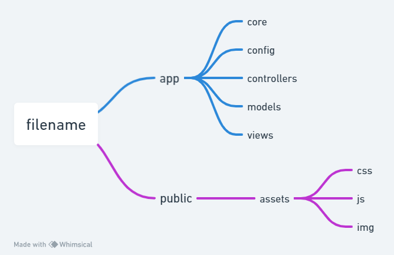
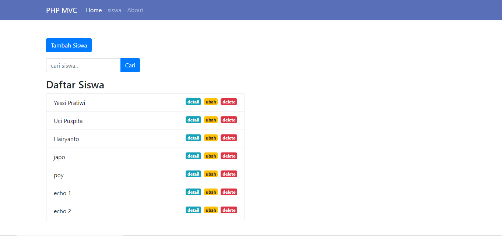

# belajar-php-mvc
yang mau ditambahkan bookshelf
<li>tambah buku</li>
<li>ubah buku</li>
<li>hapus buku</li>

### yang saya pakai
<li>php 8</li>
<li>bootstrap 4.1</li>

### database 
seperti biasa cara uploadnya lewat phpmyadmin
database ada di folder db 
<li>bookshelf.sql</li>